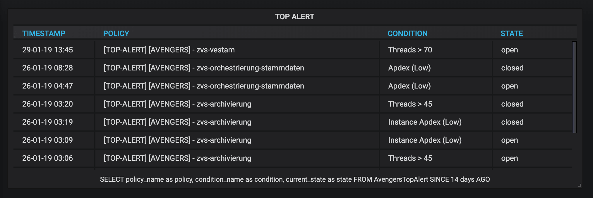

## Nrql Table Panel Plugin for Grafana

Table panel for Nrql results of the NewRelic Insight datasource

Show all selected attribute of the SELECT Nrql query :

### Plugin options

#### Options

- **Display query**:

  Activate or deactivate the display of the nrql query at the bottom of the table.

- **timestamp pattern**:

  Customise the timestamp format.

- **URL as link**:

  Display the URLs as a link with the `link text` as label.

- **Link text**:

  Text used as label for the URL's links.

### Development

Using Docker:

1. Clone the repository and `cd` to it
1. make sure you have [yarn]( https://yarnpkg.com/) installed
1. install project dependencies: `yarn install --pure-lockfile`
1. Start the "watch" task: `yarn watch`
1. Run a local Grafana instance with the development version of the plugin: `docker run -p 3000:3000 -d --name grafana-plugin-dev --volume $(pwd)/dist:/var/lib/grafana/plugins/nrql-table-panel grafana/grafana`
1. Check the logs to see that Grafana has started up: `docker logs -f grafana-plugin-dev`
1. Open Grafana at http://localhost:3000/
1. Log in with username "admin" and password "admin"
1. Create new dashboard and add the plugin

To build a production build with minification: `yarn build`
